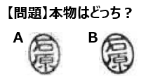
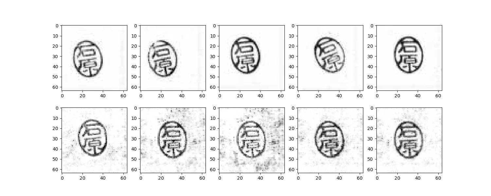
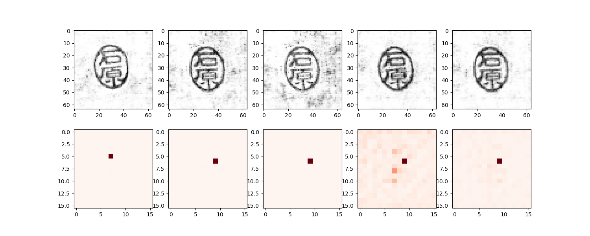

# HankoGenerator 
GANを用いたハンコのフェイク画像生成

## 準備
- ハンコ140個（縦14×横10）を押印したスキャン画像から、ハンコ１つ１つを切り出して`./data/low/hanko/`配下へ出力

```
python trimming.py
```
## 学習
- DCGANの場合
```
cd DCGAN
python DCGAN_hanko.py
```
- SAGANの場合
```
cd SAGAN
python SAGAN_hanko.py
```

## 備考
- 学習後、結果がウィンドウ表示されます。
  - 例：SAGANの学習結果（上段が本物＝学習サンプル、下段が偽物＝生成サンプル）

    

  - 例：SAGANの学習結果（上段が偽物＝生成サンプル、下段がSelf-Attention Map）

    


- デフォルトで300epochですが、変更したい場合はコマンド引数で渡す
  - 例：500epochにしたい場合

    ```
    python SAGAN_hanko.py 500
    ```
- 実験結果など
  - Qiita記事 [「GANでハンコジェネレーターをつくってみた」](https://qiita.com/ishihara-jp/items/c587f778c232cc916112)

## 参考
- 「つくりながら学ぶ！PyTorchによる発展ディープラーニング」
  - 第5章 GANによる画像生成（DCGAN, Self-Attention GAN）
  - 書籍：https://www.amazon.co.jp/dp/4839970254
  - サンプルプログラム：https://github.com/YutaroOgawa/pytorch_advanced/tree/master/3_semantic_segmentation

- ※ソースは小川雄太郎氏が開発されたものを、ほぼそのまま流用させて頂きました。

以上


